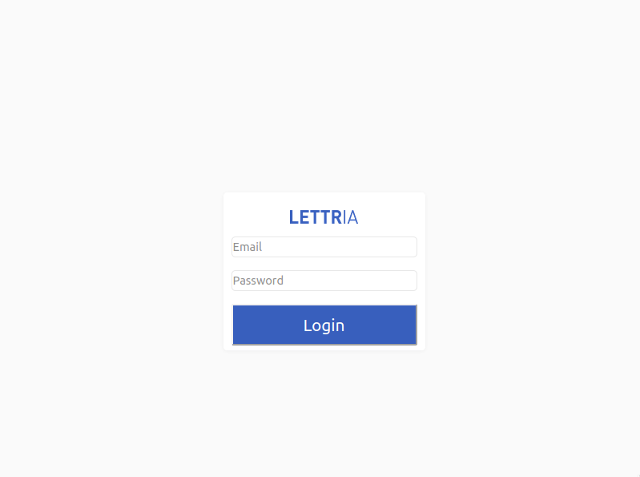

<br />
<p align="center">
  <a href="https://github.com/Thibault-collard/test-lettria">
    
  </a>

  <h3 align="center"> TEST LETTRIA</h3>

  <p align="center">
    Test de candidature au poste de développeur Front-end chez Lettria, une start-up innovante dans le domaine de l'analyse automatique du langage en langue française
		<br />
    <br />
    <a href="https://test-lettria.herokuapp.com">Voir la Demo</a>
    ·
    <a href="https://github.com/Thibault-collard/test-lettria/issues">Reporter un Bug</a>
    ·
    <a href="https://github.com/Thibault-collard/test-lettria/issues">Suggérer une feature</a>
  </p>
</p>

<!-- ABOUT THE PROJECT -->
## A propos du projet


L'objectif de ce test était de créer une application web utilisant ReactJs et Redux qui devra:
- permettre à l'utilisateur de se connecter au backend de app.lettria.com
- permettre à l'utilisateur de modifier son nom ou prénom
- stocker toutes les informations renvoyées par l'api
- afficher toutes les informations stockées


### Construit avec

* Javascript ES6
* React
* Redux
* Styled-components
* Html/CSS

<!-- GETTING STARTED -->
## Pour commencer ...

Pour se connecter à l'application sur la version de démonstration (https://test-lettria.herokuapp.com), vous pouvez entrer les identifiants suivants :
email : thibault.collard@gmail.com
MDP : $2a$05$MLKrIjAaKNN5I2vNTd1ak.jQfBWgtdYgek7QeUIPWIyaMlAE0ewye (Je serais vous, je ferais un copier-coller... Je dis ça, je dis rien.)

### Pré-requis

En plus d'avoir un environnement de programmation adéquat, il convient d'avoir des notions en Javascript, React & Redux pour bien appréhender ce projet

```

### Installation

1. Cloner le répertoire
```sh
git clone https://github.com/Thibault-collard/test-lettria.git
```
2. Installer les paquets NPM
```sh
npm install
```

<!-- USAGE EXAMPLES -->
## Compétences utilisés

- Accéder à une API externe et extraire des informations
- Utiliser Redux pour stocker des informations
- Gérer un affichage React dynamique 

<!-- ROADMAP -->
## Roadmap

- Accéder à l'API pour pouvoir trouver les informations nécessaires
- Stocker les données dans le store redux
- Y accéder à partir de la page de profil pour les afficher
- Modifier les informations et les propager dans le store redux et le composant
- Garantir un affichage constamment mis à jour des informations de l'utilisateur 

<!-- LICENSE -->
## Licence

Ce dossier et l'ensemble du code qu'il contient est accessible gratuitement, sans besoin d'attribution.
Mais n'oubliez pas que recopier sans comprendre ne fera pas progresser vos compétences.

<!-- CONTACT -->
## Contact

Pour toutes demandes : thibault.collard@gmail.com


